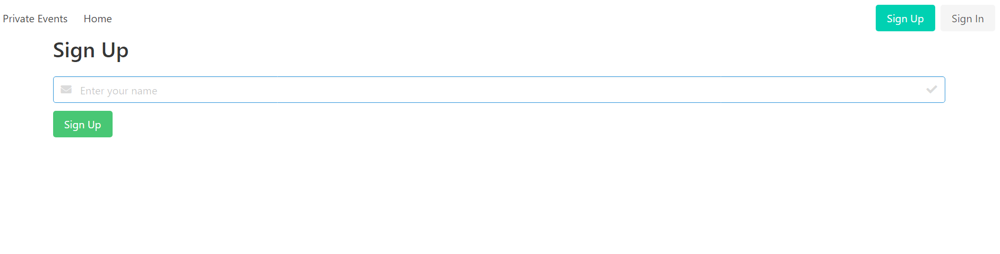
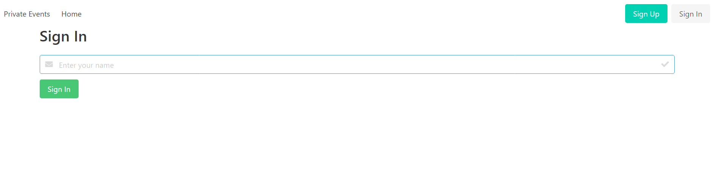
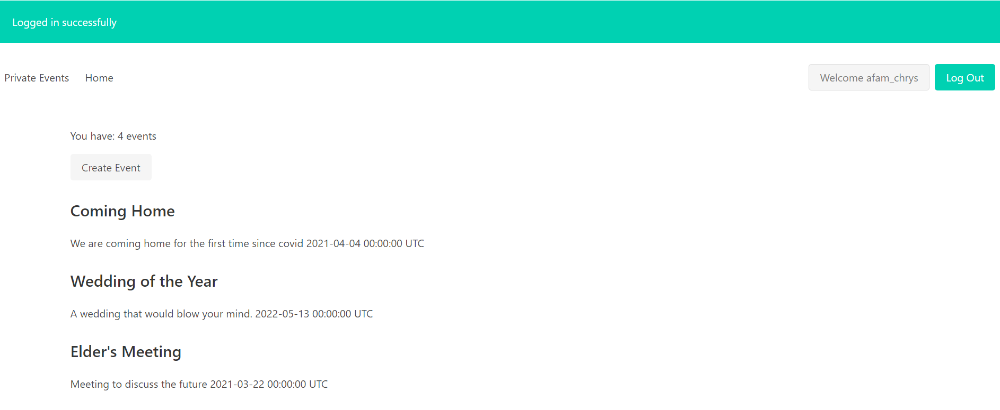
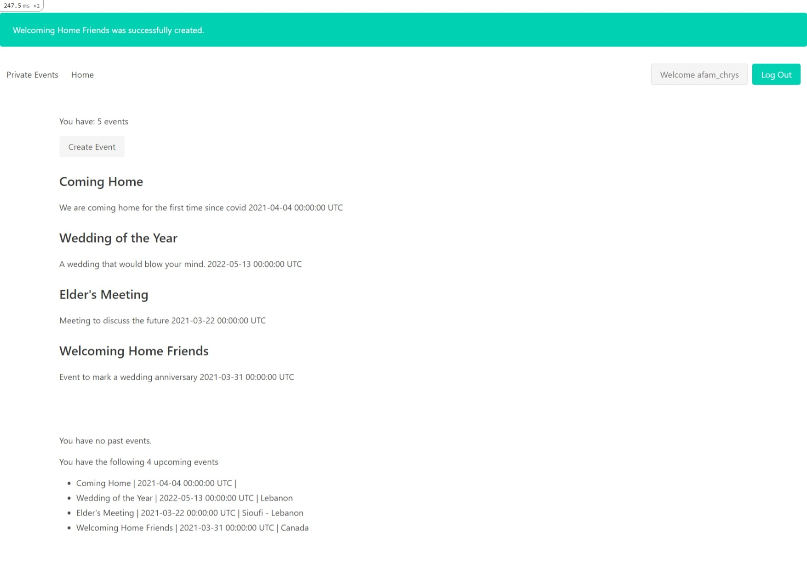

# Private 

## We build an site similar to a private Eventbrite which allows users to create events and then manage user signups. Users can create events and send invitations and parties .







## Built With

- Ruby
- Rubocop
- Visual Studio Code

### Ruby version

  ``` ruby 2.7.2 ```

### System dependencies

  ``` rails 6.1.7 ```
  ``` yarn 1.2.2 ```
  ``` node 14.15.5 ```

### Configuration

  Set up project using the above specifications
   #### For HTTPS
   - use ``` https://github.com/chrystalme/private-events.git``` to clone the repository
   #### For SSH
   - use ``` git@github.com:chrystalme/private-events.git ``` to clone the repository
   - Change to the parent directory of the project using 
    ``` cd private-events ```
   - run ```bundle install ``` to install dependencies
   - run ```rails db:migrate ``` to create schema
   - use ``` rails webpacker:install ``` to install webpacker
   - use ``` rails s ``` to run the rails server

## Authors

👤 **Ahmet Bozacı**
- Github:[@ahmtbozaci](https://github.com/ahmetbozaci)
- Twitter:[@ahmtbozaci](https://twitter.com/ahmtbozaci)
- LinkedIn:[@ahmtbozaci](https://www.linkedin.com/in/ahmetbozaci/)

👤 **Malieze Afam Ifeanyi**

- GitHub: [@chrystalme](https://github.com/chrystalme)
- Twitter: [@afam_ifeanyi](https://twitter.com/afam_ifeanyi)
- LinkedIn: [Malieze Afam Ifeanyi(chrys)](https://linkedin.com/afam-chrys)

## 🤝 Contributing

Contributions, issues, and feature requests are welcome!

Feel free to check the [issues page](https://github.com/chrystalme/private-events/issues).

## Show your support

Give a ⭐️ if you like this project!

## Acknowledgments

- [Odin Projects](https://www.theodinproject.com/courses/ruby-on-rails/lessons/associations) 
- [Microverse](https://microverse.com)

## 📝 License

This project is [MIT](https://mit-license.org/) licensed.

